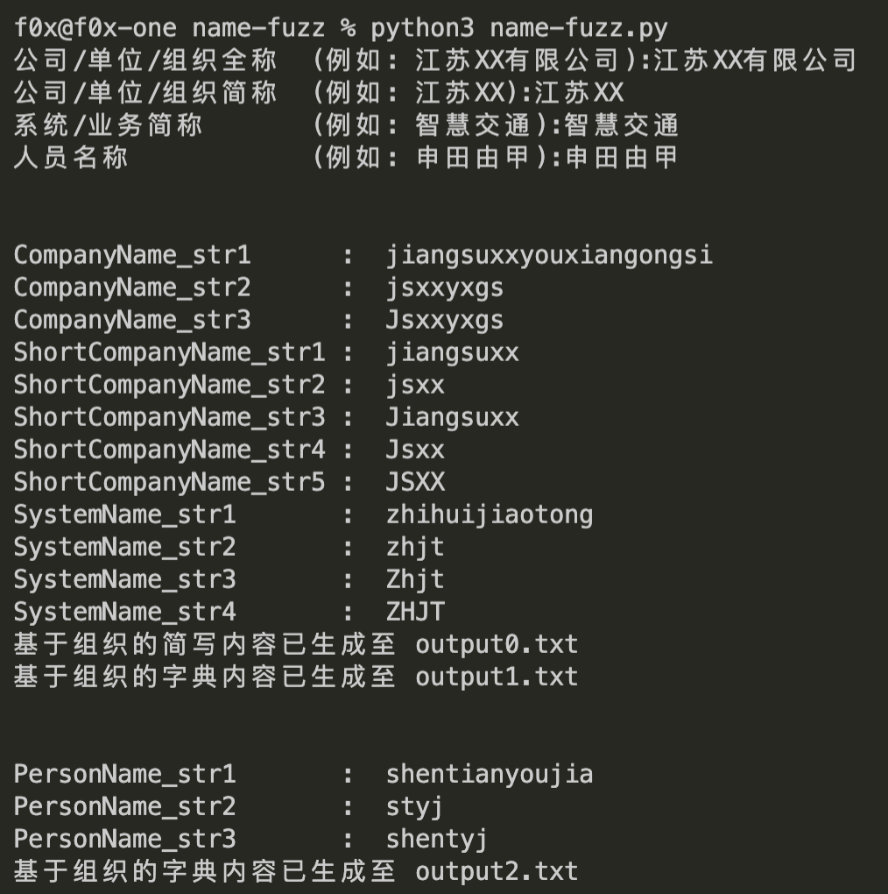

# name-fuzz

针对目标已知信息的字典生成工具

> 原理简单粗暴,调用 pypinyin 这个库将中文信息转为拼音,然后与后缀名字典拼接成字符串即可

> 如果有其他的字典生成思路和规则欢迎在 issue 提出来

---

## 开始

**下载 && 安装依赖**
```bash
git clone https://github.com/ffffffff0x/name-fuzz.git
pip3 install pyreadline pypinyin
cd name-fuzz
```

**使用**
```bash
python3 name-fuzz.py
```



---

## 支持规则

### 基于组织

`公司/单位/组织全称`+`后缀`
- jsxxyxgs123 (江苏XX有限公司)
- jsxxyxgs@123
- ...

`公司/单位/组织简称`+`后缀`
- jiangsuxx123 (江苏XX)
- jiangsuxx@123
- ...

`公司/单位/组织简称(缩写)`+`后缀`
- jsxx123 (江苏XX)
- jsxx@123
- ...

`业务名(缩写)`+`后缀`
- zhjt123 (智慧交通)
- zhjt@123
- ...

`公司/单位/组织简称(缩写)`+`系统/业务简称(缩写)`+`后缀`
- jsxxzhjt123 (江苏XX智慧交通)

### 基于人员

`人员名称`
- zhangsanfeng (拼音)
- zsf (缩写)
- zhangsf (首字拼音+缩写)
- zsfeng (缩写+尾字拼音)
- sanfengzhang (拼音+首字拼音)
- sanfengz (拼音+首字缩写)
- sfz (缩写+首字缩写)
- 张三丰 (中文)

---

## 参考项目

- https://github.com/mozillazg/python-pinyin
- https://github.com/soxoj/username-generation-guide
- https://github.com/WangYihang/ccupp
- https://gist.github.com/yuikns/387be5e9cf450ae3589fa7037c94453e
- https://www.yuque.com/pmiaowu/bomi9w/ougg6d#d70159da

---

## License

[Apache License 2.0](https://github.com/ffffffff0x/name-fuzz/blob/main/LICENSE)

---

> create by ffffffff0x
